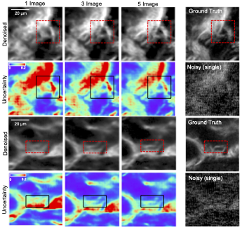

# Learned, Uncertainty-driven Adaptive Acquisition
The official PyTorch implementation of the Learned, Uncertainty-driven Adaptive Acquisition for Photon-Efficient Multiphoton Microscopy paper.

<div align="center">
  
  <br/>
  <div align="left" width="50%">
    <figcaption display="table-caption" width="70%"><b> Results of single-image, three-image, and five-image denoising, showing the image prediction and predicted uncertainty. As the number of measurements increases, the predicted image more closely matches the ground truth, and the pixel-wise uncertainty decreases.</figcaption>
  </div>
</div>

# Setup: 
Clone this project using:

```
git clone https://github.com/cassandra-t-ye/Learned_Uncertainty_Quantification.git
```

Dependencies can be installed using

```
conda env create -f environment.yml
source activate learned_uncertainty
```
