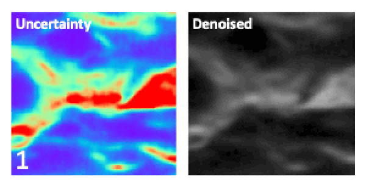

# Learned, Uncertainty-driven Adaptive Acquisition
The official PyTorch implementation of the [Learned, Uncertainty-driven Adaptive Acquisition for Photon-Efficient Multiphoton Microscopy paper](https://arxiv.org/abs/2310.16102)

<div align="center">
  
  <br/>
  <div align="left" width="60%">
    <figcaption display="table-caption" width="60%"><b> Image prediction and predicted uncertainty when denoising using 1 to 5 noisy multiphoton microscopy images. As the number of measurements increases, the predicted image more closely matches the ground truth, and the pixel-wise uncertainty decreases. </figcaption>
  </div>
</div>

# Setup: 
Clone this project using:

```
git clone https://github.com/cassandra-t-ye/Learned_Uncertainty_Quantification.git
```

Dependencies can be installed using

```
conda env create -f environment.yml
source activate learned_uncertainty
```

# Getting Started:

To get started, download the weights for our finetuned model here:

[weights](https://drive.google.com/file/d/1tTP6eeCMWohNpm9i2Mq49IbK-M6VXpE8/view?usp=sharing)

Put the finetuned model weights under the **Experiments** folder
```
./Learned_Uncertainty_Quantification/Experiments
```
Once finished, open **quickstart.ipynb** and get started!


